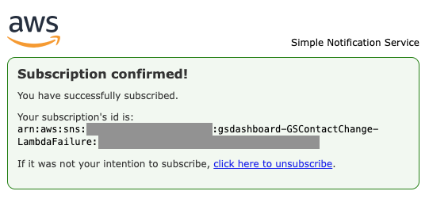
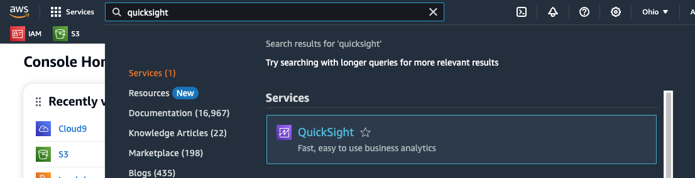
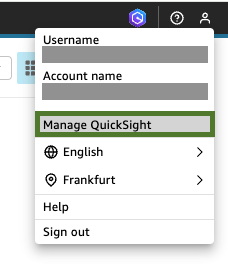
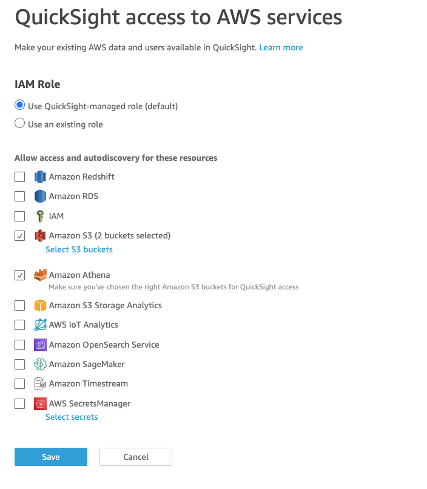
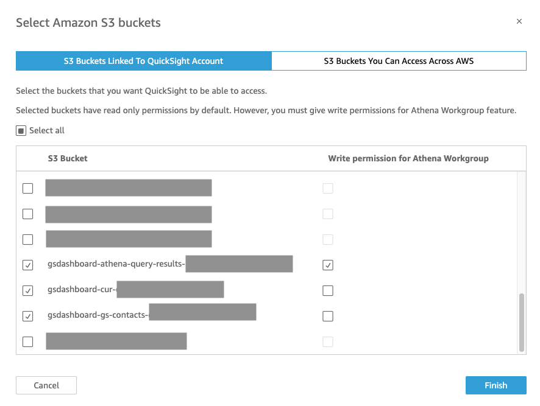

<!--
Copyright Amazon.com, Inc. or its affiliates. All Rights Reserved.

Permission is hereby granted, free of charge, to any person obtaining a copy of this
software and associated documentation files (the "Software"), to deal in the Software
without restriction, including without limitation the rights to use, copy, modify,
merge, publish, distribute, sublicense, and/or sell copies of the Software, and to
permit persons to whom the Software is furnished to do so.

THE SOFTWARE IS PROVIDED "AS IS", WITHOUT WARRANTY OF ANY KIND, EXPRESS OR IMPLIED,
INCLUDING BUT NOT LIMITED TO THE WARRANTIES OF MERCHANTABILITY, FITNESS FOR A
PARTICULAR PURPOSE AND NONINFRINGEMENT. IN NO EVENT SHALL THE AUTHORS OR COPYRIGHT
HOLDERS BE LIABLE FOR ANY CLAIM, DAMAGES OR OTHER LIABILITY, WHETHER IN AN ACTION
OF CONTRACT, TORT OR OTHERWISE, ARISING FROM, OUT OF OR IN CONNECTION WITH THE
SOFTWARE OR THE USE OR OTHER DEALINGS IN THE SOFTWARE.
-->
## Contacts dashboard for Ground Station deployment guide

### Table of contents:

* [1. Before you start](./DEPLOYMENT.md#1-before-you-start)

* [2. Solution back-end deployment](./DEPLOYMENT.md#2-solution-back-end-deployment)

* [3. (Optional) Additional regions deployment](./DEPLOYMENT.md#3-optional-additional-regions-deployment)

* [4. Dashboard deployment](./DEPLOYMENT.md#4-dashboard-deployment)

* [5. (Optional) Cost and Usage Report data backfill](./DEPLOYMENT.md#5-optional-cost-and-usage-report-data-backfill)

* [6. Troubleshooting](./DEPLOYMENT.md#6-troubleshooting)

### 1. Before you start

* This solution is capable of centralising and managing data for AWS Ground Station activity in a single AWS account. If your organization manages a multi-account environment in AWS, please deploy this solution in the AWS account that is used to book and manage contacts with AWS Ground Station service.

* Multi-region capabilities (please refer to the [architecture diagram](./README.md#3-reference-architecture) of the solution):

    * **Scenario 1:** If you only book AWS Ground Station contacts using the AWS Ground Station service in a single region, then the recommendation is to select that region as the *central region* for the deployment of this solution. In any case, the *central region* will have to be one where [AWS Ground Station is supported](https://aws.amazon.com/about-aws/global-infrastructure/regional-product-services/).

    * **Scenario 2:** If you are booking AWS Ground Station contacts using the AWS Ground Station service in different regions, and want all of those contacts included in the dashboard solution, then the *central region* where the solution back-end and dashboard will be deployed will have to be one of the regions where both [Eventbridge cross-region routing is supported](https://docs.aws.amazon.com/eventbridge/latest/userguide/eb-cross-region.html) and [AWS Ground Station is supported](https://aws.amazon.com/about-aws/global-infrastructure/regional-product-services/). The recommendation is to choose the region from which you book most AWS Ground Station contacts as your *central region*, provided Eventbridge cross-region routing is supported there.

### 2. Solution back-end deployment

1. In the AWS Management console, navigate to your selected *central region*.

2. Open the AWS CloudFormation Console.

3. Choose **Create stack**, then **With new resources (standard)**.

4. Choose **Template is ready**, **Upload a template file**, and select `gsdashboard-part1.yml`.

5. Choose **Next**.

6. Give the stack a name, for instance, *gsdashboard*.

7. Provide values for all parameters:
    * **CURReportName**: Name for the Cost and Usage Report that will be created in the account.  
    * **ContactsMaxAge**: Number of days to use when importing AWS Ground Station historical data. Contacts older than this period will not be considered. 
    * **S3BucketCUR**: Name for the S3 bucket that will contain the AWS Cost and Usage Report. CloudFormation stack name will be added as a prefix to the name of the bucket. 
    * **S3BucketGS**: Name for the S3 bucket that will contain the AWS Ground Station contacts information. CloudFormation stack name will be added as a prefix to the name of the bucket.
    * **GSCrawlerCronScheduleExpression**: Execution frequency of the AWS Ground Station data Glue Crawler using a cron expression. See [this page](https://docs.aws.amazon.com/glue/latest/dg/monitor-data-warehouse-schedule.html) for more info. Please note that increasing the frequency of the Glue crawler runs can cause new or updated contact data to appear in the dashboard sooner; however, it will also increase the cost associated to the solution.
    * **ApplicationTag**: Tag value for the tag that is added to the created resources. Tag key will be 'application'.
    * **FailureNotificationEmail**: Email address to send failure notifications to.

8. Choose **Next**.

9. Add optional tags if needed.

10. Choose **Next**.

11. Review your stack options and parameters. Under **Capabilities**, select the checkbox, and then choose **Submit**.

12. Wait until CloudFormation stack status evolves to *CREATE_COMPLETE*.

13. During the deployment, you will receive an SNS suscription notification from no-reply@sns.amazonaws.com in the email address provided - please click **Confirm subscription**. You will be redirected to the following screen.

    

### 3. (Optional) Additional regions deployment

**Note:** This section is only relevant for users considering **Scenario 2** in the [1. Before you start](./DEPLOYMENT.md#1-before-you-start) section. If your use case falls under **Scenario 1**, please skip to [4. Dashboard deployment](./DEPLOYMENT.md#4-dashboard-deployment).

For each additional region (different from the *central region*) from which you book contacts using AWS Ground Station service, please follow these steps:

1. In the AWS Management console, navigate to your *additional region*.

2. Open the CloudFormation Console.

3. Choose **Create stack**, then **With new resources (standard)**.

4. Choose **Template is ready**, **Upload a template file**, and select `gsdashboard-additional-region.yml`.

5. Choose **Next**.

6. Give the stack a name, for instance, *gsdashboard-additionalregion*.

7. Provide values for all parameters:
    * **CentralEventBridgeBusArn**: Arn of the EventBridge bus in *central region*. The Arn follows this pattern: *arn:aws:events:**AWS-REGION**:**AWS-ACCOUNT-ID**:event-bus/default*

8. Choose **Next**.

9. Add optional tags if needed.

10. Choose **Next**.

11. Review your stack options and parameters. Under **Capabilities**, select the checkbox, and then choose **Submit**.

12. Wait until CloudFormation stack status evolves to *CREATE_COMPLETE*.

### 4. Dashboard deployment

#### 4.1. Amazon Quicksight manual configuration

Please follow the configuration steps in section [4.1.1](./DEPLOYMENT.md#411-quicksight-configuration-for-existing-users) if you already use Amazon Quicksight in this AWS account. Otherwise, please follow the activation and configuration steps in [4.1.2](./DEPLOYMENT.md#412-quicksight-activation-and-configuration-for-new-users).

##### 4.1.1. Quicksight configuration for existing users

1. Navigate to Quicksight

    

2. Choose **Manage QuickSight** at the top right corner.

    

3. If you're asked to switch to a different region to edit permissions, please do so.

4. Choose **Security & permissions**.

5. Under Manage permissions, choose **Manage**.

6. Make sure you allow access to Amazon Athena and Amazon S3. For Amazon S3, click on **Select S3 buckets** and select the bucket where GS contact information is stored, the bucket where CUR information is stored and also the bucket that stores Athena query results. These three buckets have already been created as part of the GS dashboard solution deployment and their names start with the CloudFormation stack name defined in [2. Solution back-end deployment](./DEPLOYMENT.md#2-solution-back-end-deployment). Additionally, for the Athena query results bucket, please also select the **Write permission for Athena workgroup** option:

    

    

7. Click **Save**.

##### 4.1.2. Quicksight activation and configuration for new users

1. Navigate to Quicksight.

    

2. Click **Sign up for Quicksight**.

3. Follow the steps described in the [Quicksight documentation](https://docs.aws.amazon.com/quicksight/latest/user/signing-up.html) to sign up for an **Enterprise** subscription. Please note that this solution does not require *Quicksight Q* nor *Paginated Reports* features. 

4. As part of the process, make sure you allow access to Amazon Athena and Amazon S3. For Amazon S3, click on **Select S3 buckets** and select the bucket where GS contact information is stored, the bucket where CUR information is stored and also the bucket that stores Athena query results. These three buckets have already been created as part of the GS dashboard solution deployment and their names start with the CloudFormation stack name defined in [2. Solution back-end deployment](./DEPLOYMENT.md#2-solution-back-end-deployment). Additionally, for the Athena query results bucket, please also select the **Write permission for Athena workgroup** option:

    

    

6. Click **Finish** and wait for the confirmation screen.


#### 4.2. Deploy CloudFormation template

**IMPORTANT:** After you create an AWS Cost and Usage report, it can take up to 24 hours for AWS to deliver the first report to your Amazon S3 bucket. Additionally, the Glue crawler that crawls the CUR information is scheduled to run once per day. Therefore, before continuing with this deployment, make sure you leave enough time for the CUR report to be created and also for the CUR crawler to run afterwards.

1. In the AWS Management console, navigate to your *central region*.

2. Open the Athena console, **Query editor** tab.
    * Select Data source *AwsDataCatalog*.
    * Select Database *gsdashboard*.
    * Write down the names of the two tables in the database. One corresponds to the table containing the CUR report data, and the other one corresponds to the table containing the AWS Ground Station contacts information. You will be able to identify them based on the names you selected for the CUR report and the S3 buckets during [2. Solution back-end deployment](DEPLOYMENT.md#2-solution-back-end-deployment).
    * **NOTE:** If you receive a notice in the Athena console asking you to *Upgrade to AWS Glue Data Catalog*, simply click upgrade, then click upgrade again in the next screen. The IAM policies in this solution do not need updating.

3. Open the CloudFormation Console.

4. Choose **Create stack**, then **With new resources (standard)**.

5. Choose **Template is ready**, **Upload a template file**, and select `gsdashboard-part2.yml`.

6. Choose **Next**.

7. Give the stack a name, for instance, *gsdashboard-part2*.

8. Obtain your Quicksight Principal user Arn following [these instructions](https://docs.aws.amazon.com/solutions/latest/devops-monitoring-dashboard-on-aws/step-1.html).

9. Provide values for all parameters:
    * **AmazonQuicksightPrincipalArn**: Arn for Quicksight Principal user. 
    * **CURtable**: Name of the table storing CUR report data (see point 2 above).
    * **GStable**: Name of the table storing Ground Station contacts data (see point 2 above).
    * **GsContactPart1StackName**: Name of the CloudFormation stack created in [2. Solution back-end deployment](./DEPLOYMENT.md#2-solution-back-end-deployment).
    * **ApplicationTag**: Tag value for the tag that is added to the created resources. Tag key will be 'application'.

10. Choose **Next**.

11. Add optional tags if needed.

12. Choose **Next**.

13. Review your stack options and parameters. Under **Capabilities**, select the checkbox, and then choose **Submit**.

14. Wait until CloudFormation stack status evolves to *CREATE_COMPLETE*.

### 5. (Optional) Cost and Usage Report data backfill

If you wish to backfill your Cost and Usage Report with past data, please follow the instructions [here](https://docs.aws.amazon.com/cur/latest/userguide/troubleshooting.html#backfill-data).

### 6. Troubleshooting

* Quicksight cannot refresh the data in the dashboard: If you are receiving the following error message *Your database generated a SQL exception. This can be caused by query timeouts, resource constraints, unexpected DDL alterations before or during a query, and other database errors. Check your database settings and your query, and try again*.
    1. Please review that Quicksight has the right permissions:

        * Open the Quicksight console.
        * Choose **Manage Quicksight**.
        * Choose **Security & Permissions**.
        * Configure access to the supported services that you use, as described in [4.1. Amazon Quicksight manual configuration](./DEPLOYMENT.md#41-amazon-quicksight-manual-configuration).

    2. If the issue persists, open Amazon Athena, select *gsdashboard* database, and try to visualize the *gsdashboardview* view, for instance, with the following query: `SELECT * FROM gsdashboardview LIMIT 10`. If the query fails with a `VIEW_IS_STALE` error, recreate *gsdashboardview* by running the following query. Please substitute **`GS_CONTACTS_TABLE_NAME`** and **`CUR_TABLE_NAME`** with the appropriate values, which are the same ones provided in [4.2. Deploy CloudFormation template](./DEPLOYMENT.md#42-deploy-cloudformation-template).
        ```bash
        CREATE OR REPLACE VIEW gsdashboardview AS (SELECT gs.*, dc.* 
        FROM gsdashboard.GS_CONTACTS_TABLE_NAME gs LEFT JOIN (SELECT *, SPLIT(line_item_resource_id, '/')[2] AS curcontactid 
        FROM gsdashboard.CUR_TABLE_NAME WHERE product_product_name = 'AWS Ground Station') dc 
        ON dc.curcontactid = gs.contactid)
        ```


* Some new Ground Station contacts are not appearing in the dashboard: Please note that the Glue crawler that infers the database and table schemas from the S3 bucket containing AWS Ground Station contact information will run according to the frequency defined in the **GSCrawlerCronScheduleExpression** parameter. Because of this, it might take up to this time for the first contact scheduled for a given day to appear on the Quicksight dashboard. 